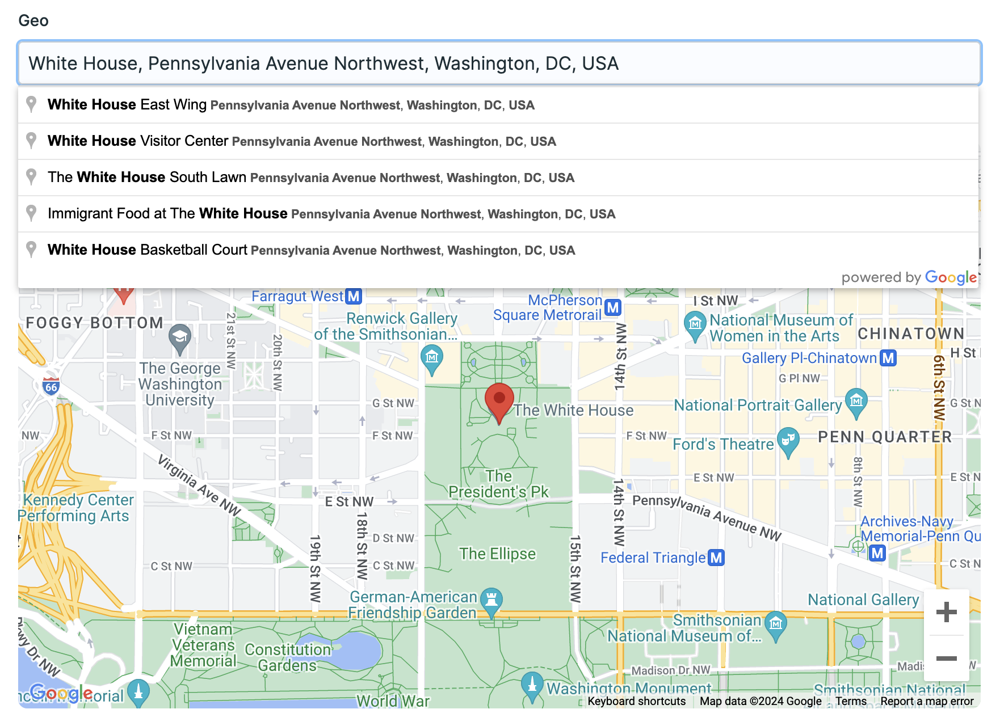

# Geocoder

Geocode your Statamic content using Google Maps Places autocomplete



## How to Install

1. Run the following command from your project root:

``` bash
composer require trendyminds/statamic-geocoder
```

2. Publish the config file and add your Google Maps API key to the added config within `config/statamic/geocoder.php`.

```bash
php artisan vendor:publish --tag=geocoder-config
```

## Templating

When returning your geocoded data you'll have object properties for the selected location. For example if your selected place is:

**White House, Pennsylvania Avenue Northwest, Washington, DC, USA**

Your field object properties would like similar to this:

```yaml
your_geo_field:
  name: 'The White House'
  place: 'White House, Pennsylvania Avenue Northwest, Washington, DC, USA'
  lat: 38.8976763
  lng: -77.0365298
  address: '1600 Pennsylvania Avenue NW'
  city: Washington
  state: DC
  zip: '20500'
```

And you can output the data as a standard Antlers object:

```antlers
{{# Within a loop context #}}
{{ your_geo_field }}
  {{ name }}
  {{ place }}
  {{ lat }}
  {{ lng }}
{{ /your_geo_field }}

{{# As individual properties #}}
{{ your_geo_field:name }}
{{ your_geo_field:place }}
{{ your_geo_field:lat }}
{{ your_geo_field:lng }}
```
